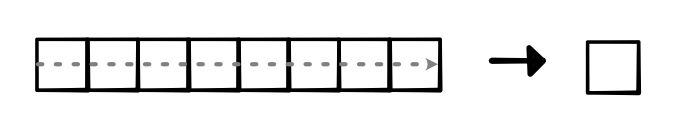

# MiniTorch

MiniTorch is a library for machine learning engineers who wish to learn about the internal concepts underlying deep learning systems. It is a pure Python re-implementation of the Torch API designed to be simple, easy-to-read, tested, and incremental. The final library can run Torch code.

## Setup

MiniTorch requires Python 3.8 or higher. To check your version of Python, run either:

```bash
>>> python --version
```

The next step is to install packages. There are several packages used throughout these assignments, and you can install them in your virtual environment by running:

```bash
>>> python -m pip install -r requirements.txt
>>> python -m pip install -r requirements.extra.txt
>>> python -m pip install -Ue .
```

For anaconda users, you need to run an extra command to install llvmlite:

```bash 
>>> conda install llvmlite
```

llvmlite is a dependency of numba, which is a dependency of the numba-jit package. This package is used to speed up the code in the library. If you are having trouble installing llvmlite, you can remove the numba-jit package from the requirements.extra.txt file.

Make sure that everything is installed by running python and then checking:

```bash
>>> import minitorch
```

## Fundamentals

### Operators

 These functions are simple, but they form the basis of MiniTorch. Make sure that you understand each of them as some terminologies might be new.

```shell
minitorch.operators.mul(x: float, y: float) -> float
minitorch.operators.id(x: float) -> float
minitorch.operators.eq(x: float, y: float) -> float
minitorch.operators.neg(x: float) -> float
minitorch.operators.add(x: float, y: float) -> float
minitorch.operators.max(x: float, y: float) -> float
minitorch.operators.lt(x: float, y: float) -> float
minitorch.operators.sigmoid(x: float) -> float
minitorch.operators.relu(x: float) -> float
minitorch.operators.inv(x: float) -> float
minitorch.operators.inv_back(x: float, d: float) -> float
minitorch.operators.relu_back(x: float, d: float) -> float
minitorch.operators.log_back(x: float, d: float) -> float
minitorch.operators.is_close(x: float, y: float) -> float
```

### Testing and Debugging

```shell
tests/test_operators.py
```

### Functional Python

The use of higher-order functions in Python, implement three basic functional concepts.

```shell
minitorch.operators.map(fn: Callable[[float], float]) -> Callable[[Iterable[float]], Iterable[float]]
minitorch.operators.negList(ls: Iterable[float]) -> Iterable[float]
minitorch.operators.zipWith(fn: Callable[[float, float], float]) -> Callable[[Iterable[float], Iterable[float]], Iterable[float]]
minitorch.operators.addLists(ls1: Iterable[float], ls2: Iterable[float]) -> Iterable[float]
minitorch.operators.reduce(fn: Callable[[float, float], float], start: float) -> Callable[[Iterable[float]], float]]
minitorch.operators.sum(ls: Iterable[float]) -> float
minitorch.operators.prod(ls: Iterable[float]) -> float
```

### Module Sandbox

```shell
>>> streamlit run app.py -- 0
```

## Autodiff


We utilized the computation graph as a way to automatically compute derivatives of arbitrary python functions. The trick behind this auto differentiation is to implement the derivative of each invidual function, and then utilize the chain rule to compute a derivative for any scale value.


### Chain Rule

#### One argument

Let us say that we have a complex function :math:`h(x) = f(g(x))`. We
want to compute :math:`h'(x)`. For simplicity, we use :math:`z = g(x)`,
and draw :math:`h` as two boxes left to right.


The chain rule tell us how to compute this term. Specifically it gives the following formula.

$$
   \begin{eqnarray*}
   d &=& 1 \cdot f'(z) \\
   h'_x(x) &=&  d \cdot g'(x) \\
   \end{eqnarray*}
$$

The above derivative function tells us to compute the derivative of the
right-most function (:math:`f`), and then multiply it by the derivative of the left function (:math:`g`).

Here is where the perspective of thinking of functions as boxes pays
off. We simply reverse the order.


The :math:`d` multiplier passed to `backward` of
the first box (left) should be the value returned by `backward` of the
second box.  The 1 at the end is to start off the chain rule process
with a value for :math:`d_{out}`.

## Tensors


Tensor is a fancy name for a simple concept. A tensor is a multi-dimensional array of arbitrary dimensions. It is a convenient and efficient way to hold data, which becomes much more powerful when paired with fast operators and auto differentiation.

### Tensor Shapes

1-dimensional tensor (vector):


2-dimensional tensor (matrix):


three-dimensional tensor with shape (2, 3, 3) and size 18


### Tensor Strides

<p>Users of a Tensor library only have to be aware of the <code>shape</code> and
<code>size</code> of a tensor. However, there are important implementation details
that we need to keep track of.  To make our code a bit cleaner, we
need to separate out the internal <code>tensor data</code> from the user-facing
tensor.  In addition to the <code>shape</code>, <code>minitorch.TensorData</code>
manages tensor <code>storage</code> and <code>strides</code>:</p>

<ul>
<li><strong>Storage</strong> is where the core data of the tensor is kept. It is always a
1-D array of numbers of length <code>size</code>, no matter the dimensionality or
<code>shape</code> of the tensor. Keeping a 1-D storage allows us to have tensors with
different shapes point to the same type of underlying data.</li>
</ul>

<ul>
<li><strong>Strides</strong> is a tuple that provides the mapping from user indexing
to the position in the 1-D <code>storage</code>.</li>
</ul>


### Broadcasting

<p>Broadcasting makes tensors convenient and
efficient to use, which comes in handy particularly for <code>zip</code> operations.
So far all of our <code>zip</code> operations assume two input
tensors of <strong>exactly</strong> the same size and shape. However there are many
interesting cases to <code>zip</code> two tensors of different size.</p>


### Operations

#### map


#### zip


#### reduce


### Auto-Grad

#### map


#### zip


#### reduce


## Efficiency (CUDA, numba)

This module is focused on taking advantage of tensors to write fast code, first on standard CPUs and then using GPUs.

### Parallel Computation


The major technique we will use to speed up computation is parallelization. General parallel code can be difficult to write and get correct. However, we can again take advantage of the fact that we have structured our infrastructure around a set of core, general operations that are used throughout the codebase.

#### Numba JIT

Numba is a numerical JIT compiler for Python. When a function is first created, it converts raw Python code to faster numerical operations under the hood. We have seen an example of this library earlier when developing our mathematical operators.

e.g.

```python
def neg(x):
    return -x


def map(fn):
    fn = njit()(fn)

    def _map(out, input):
        # Change 3: Run the loop in parallel (prange)
        for i in prange(len(out)):
            out[i] = fn(input[i])

    return njit(parallel=True)(_map)
```

### GPU Programming


CPU parallelization and operator fusion is important, but when you really need efficiency and scale, specialized hardware is critical. It is really hard to exaggerate how important GPU computation is to deep learning: it makes it possible to run many models that would have been intractable even just several years ago.

Writing code of GPUs requires a bit more work than the CPU parallelization examples. GPUs have a slightly different programming model than CPUs, which can take some time to fully understand. Luckily though, there is a nice Numba library extension that allows us to code for GPUs directly in Python.

#### CUDA


The most commonly used programming model for GPUs in deep learning is known as CUDA. CUDA is a proprietary extension to C++ for Nvidia devices. Once you fully understand the terminology, CUDA is a relatively straightforward extension to the mathematical code that we have been writing.

##### local memory


##### block


##### grid


## Networks

### Convolution


#### 1D Convolution


### Pooling




